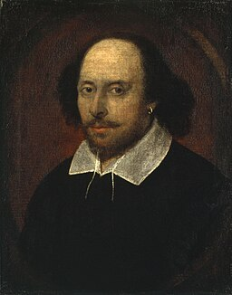

# Shakespeare Text Generation — Recurrent Neural Network (RNN)

This project implements a **character-level Recurrent Neural Network (RNN)** using PyTorch to generate text based on the works of William Shakespeare. The task focuses on modelling **sequential text data** using recurrent architectures and explores the challenges of learning structure and coherence in language.

This project represents my **first foray into text-based machine learning**, extending my experience with neural networks from numerical and image data into natural language processing.

The Chandos portrait of William Shakespeare, Wikimedia Commons.

---

## What’s in this repository

- **Jupyter Notebook:** RNN implementation and training workflow (`shakespeare_task.ipynb`)  
- **Dataset:** Tiny Shakespeare text (`input_tiny_shakespeare.txt`)  
- **Images:** example outputs and visualisations  
- **Requirements:** Python dependencies (`requirements.txt`)  

---

## Project Context

Unlike traditional feedforward neural networks, text data is inherently sequential — meaning that context and order strongly influence meaning. Recurrent Neural Networks address this challenge by maintaining an internal state that carries information forward through a sequence.

In this project, a simple RNN was trained on the **Tiny Shakespeare dataset**, a collection of text extracted from Shakespeare’s plays and sonnets. The objective was to build a character-level language model capable of predicting the next character in a sequence and generating new text based on learned patterns.

---

## Approach Overview

- Text preprocessing and character mapping  
- Sequence generation using sliding windows  
- One-hot encoding of input and target characters  
- Construction of a simple RNN architecture  
- Training using cross-entropy loss and the Adam optimiser  
- Evaluation using loss and perplexity metrics  
- Text generation from a seed sequence  

---

## Key Insights / Findings

- The model learned basic character-level patterns such as spacing, punctuation, and common letter combinations.  
- Generated text exhibited limited semantic coherence, reflecting the constraints of a simple RNN architecture.  
- Loss values improved only marginally, indicating that additional training time and architectural refinement would be required for stronger performance.  
- These results are consistent with known limitations of vanilla RNNs, particularly their difficulty in retaining long-range context.  

Overall, the project illustrates both the potential and limitations of early recurrent architectures in language modelling tasks.

---

## Skills Demonstrated

**Analysis**
- Text preprocessing and sequence construction  
- Interpretation of loss and perplexity metrics  

**Modelling**
- Character-level Recurrent Neural Networks  
- Sequential data modelling  
- Neural network training workflows  

**Evaluation**
- Model performance assessment using perplexity  
- Interpretation of generated text output  

**Tools**
- Python  
- PyTorch  
- NumPy  
- Jupyter Notebook  

---

## Requirements

Install the required Python packages with: `pip install -r requirements.txt`

---

## Why this project belongs in my portfolio
Text generation presents fundamentally different challenges from tabular or image-based modelling, requiring an understanding of sequence, memory, and context.

This project demonstrates my ability to extend core machine learning concepts into natural language data, evaluate model behaviour critically, and recognise the limitations of early architectures. While results are modest, the analysis provides a strong foundation for future exploration of more advanced NLP models such as LSTM, GRU, and transformer-based architectures.
